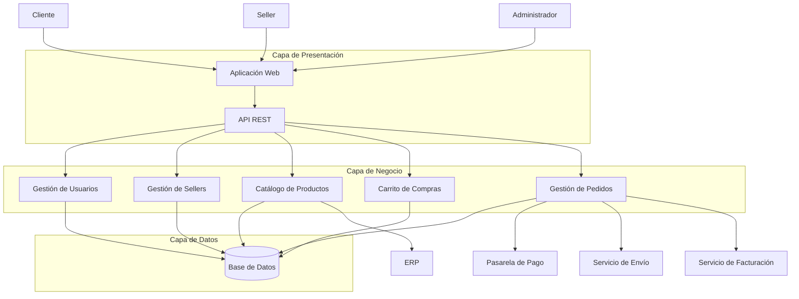

# Arquitectura inicial del Marketplace

## 1. Descripción

El sistema Marketplace de productos para mascotas se diseñará utilizando una arquitectura en tres capas. Esta arquitectura permite separar la presentación, la lógica de negocio y el acceso a los datos, facilitando el mantenimiento y evolución del sistema.

## 2. Capa de presentación

La capa de presentación será responsable de la interacción con los usuarios y de recibir y enviar las solicitudes hacia el sistema.

**Componentes principales:**

* Aplicación Web
* API REST

**Actores que interactúan:**

* Cliente
* Seller
* Administrador

## 3. Capa de negocio

La capa de negocio contiene las reglas y funcionalidades principales del Marketplace.

**Módulos principales:**

* Gestión de usuarios
* Gestión de sellers
* Catálogo de productos
* Carrito de compras
* Gestión de pedidos

Esta capa procesa las solicitudes recibidas desde la capa de presentación y aplica las reglas de negocio correspondientes.

## 4. Capa de datos

La capa de datos se encarga del almacenamiento y recuperación de la información del sistema.

**Componente principal:**

* Base de datos

La base de datos almacenará información relacionada con usuarios, sellers, productos, carritos y pedidos.

## 5. Sistemas externos

El Marketplace requiere integrarse con diferentes servicios externos:

* **Pasarela de pago:** procesa los pagos realizados por los clientes.
* **Servicio de envío:** gestiona la información relacionada con la entrega de los pedidos.
* **Servicio de facturación:** genera los comprobantes correspondientes.
* **ERP:** proporciona información relacionada con productos y stock.

## 6. Flujo general

El flujo principal de comunicación será:

**Actores → Capa de Presentación → Capa de Negocio → Capa de Datos**

La capa de negocio también podrá comunicarse con los servicios externos cuando una funcionalidad lo requiera.

## 7. Justificación

La arquitectura en tres capas permite separar las responsabilidades del sistema. Esto facilita el mantenimiento, mejora la organización del código y permite realizar cambios en una capa reduciendo el impacto sobre las demás.

Además, esta separación permite considerar los drivers arquitectónicos identificados, especialmente rendimiento, escalabilidad, seguridad e integración con servicios externos.

## 8. Diagrama de arquitectura inicial

## 9. Descripción del flujo

El cliente, seller y administrador interactúan con el sistema mediante la aplicación web. La aplicación web se comunica con la API REST, que recibe las solicitudes y las dirige a los módulos correspondientes de la capa de negocio.

La capa de negocio procesa las reglas del sistema y utiliza la capa de datos para almacenar o consultar información. Además, algunos módulos se comunican con servicios externos como la pasarela de pago, el servicio de envío, el servicio de facturación y el ERP.