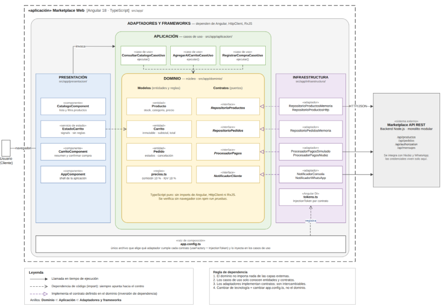

# Enfoque Arquitectónico - Clean Architecture

A continuación se muestra el diagrama que detalla la estructura en capas (Presentación, Dominio, Aplicación, Infraestructura) y la dirección de las dependencias bajo el enfoque de Clean Architecture:

